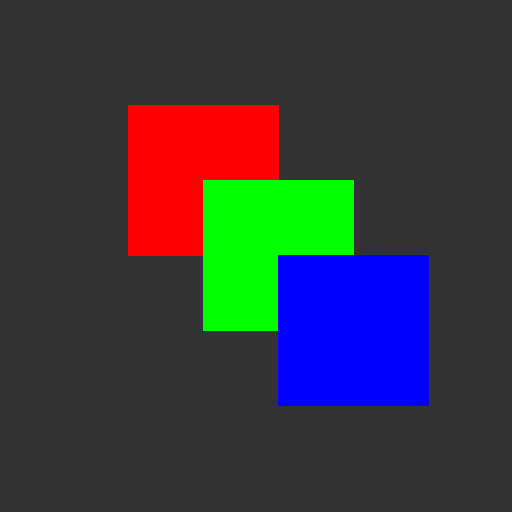

<h1>Basic 3D Software Renderer</h1>

It uses memory and math to draw pretty pictures. No OpenGL or other libraries (within reason).

Things are simply being rendered to a .bmp file, and this was only tested on Linux (Ubuntu 22.04 LTS).

Here's a basic rectangle with a solid clear color in the background:
