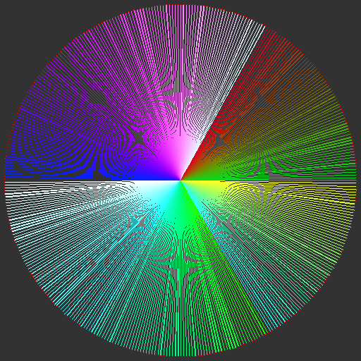

<h1>Basic 3D Software Renderer</h1>

It uses memory and math to draw pretty pictures. No OpenGL or other libraries (within reason).

Things are simply being rendered to a .bmp file, and this was only tested on Linux (Ubuntu 22.04 LTS).

Supported commands:
| Command | Result |
| --- | --- |
| ./run.sh main | Execute the main code |
| ./run.sh debug | Execute the debug code |
| ./run.sh tests | Execute the runtime tests & generate doc images |

Basic features supported so far:

| Description | Image |
| --- | --- |
| Basic Rectangle               |  |
| Lines                         |  |
| Full 360deg range w/ lines    |  |
| Circles                       |  |
| 2D Triangles (partial)        |  |